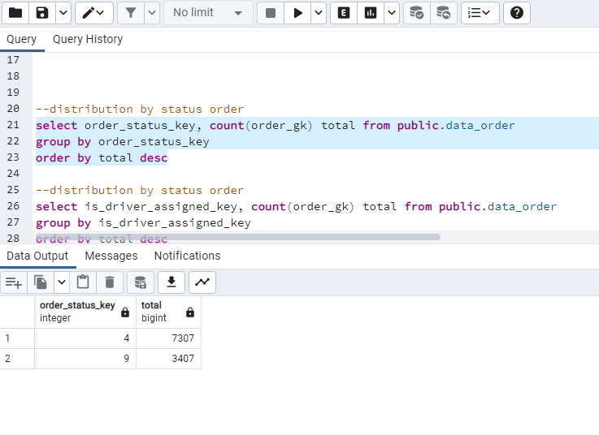
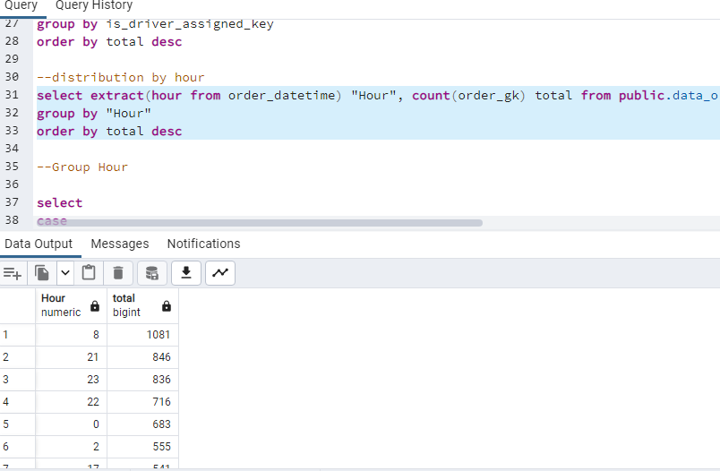
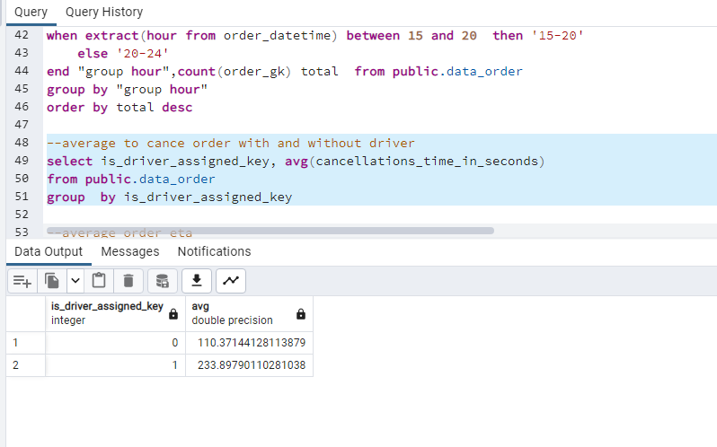

 <a href="https://achmadirfana.github.io/portofolio/portfolio-gettaxi.html">Back</a>

<h2> Gettaxi</h2>

 URL Dashoboard project (Bonus) : <a href="">Gettaxi</a>

<h3> 1. Background Project :</h3>

 This is my personal project and I use postgresql to do. This project is about gettaxi, is an Israeli-developed technology platform solely focused on corporate Ground Transportation Management (GTM). They have an application where clients can order taxis, and drivers can accept their rides (offers). At the moment, when the client clicks the Order button in the application, the matching system searches for the most relevant drivers and offers them the order. In this task, we would like to investigate some matching metrics for orders that did not completed successfully, i.e., the customer didn't end up getting a car

<h3>2. Purpose:</h3>

  The main purpose is to provide a number of isnight and recomendation about the data. To do this,
first I  need to identify the following data:

•  Build up distribution of orders according to reasons for failure: cancellations before and after driver assignment, and reasons for order rejection. Analyse the resulting plot. Which category has the highest number of orders? 

•  Plot the distribution of failed orders by hours. Is there a trend that certain hours have an abnormally high proportion of one category or another? What hours are the biggest fails? How can this be explained? 

•  Plot the average time to cancellation with and without driver, by the hour. If there are any outliers in the data, it would be better to remove them. Can we draw any conclusions from this plot?  

•  Plot the distribution of average ETA by hours. How can this plot be explained?

<h3>3. Dataset:</h3>

The project source is from stratascratch platfrom and can be accessed in this following link : <a href="https://platform.stratascratch.com/data-projects/insights-failed-orders">Click here</a>

Data can be access in the following link : <a href="https://docs.google.com/spreadsheets/d/1ZX1L2hk1vAPlnWxEwaG-EnvGeM0fUqBK1O7EGHwZ3KI/edit?usp=sharing">Click here</a>

Data description:

 

 
The data_order data set with 8 columns: 

order_datetime - time of the order 

origin_longitude - longitude of the order 

origin_latitude - latitude of the order 

m_order_eta - time before order arrival 

order_gk - order number 

order_status_key - status, an enumeration consisting of the following mapping: 

4 - cancelled by client, 

9 - cancelled by system, i.e., a reject 

is_driver_assigned_key - whether a driver has been assigned 

cancellation_time_in_seconds - how many seconds passed before cancellation 

The data_offerf data set is a simple map with 2 columns: 

order_gk - order number, associated with the same column from the orders data set 

offer_id - ID of an offer 

	
  

  
<h3>4. Data Preparation</h3>
<h4 style="margin-left: 10px">4.1 Data Validation</h4>

 All the data must be checked whetever there is a abnormal data. The  queery for data checking and validating :

	
 

 --data validation 

 select min(order_datetime),max(order_datetime) from public.data_order --no found abnormal data-- 

 select min(origin_longitude),max(origin_longitude) from public.data_order --no found abnormal data-- 

 select min(origin_latitude),max(origin_latitude) from public.data_order --no found abnormal data-- 

 select min(m_order_eta),max(m_order_eta) from public.data_order --no found abnormal data-- 

 select min(order_gk),max(order_gk) from public.data_order --no found abnormal data-- 

 select min(order_status_key),max(order_status_key) from public.data_order --no found abnormal data-- 
	

 select min(is_driver_assigned_key),max(is_driver_assigned_key) from public.data_order --no found abnormal data-- 

 select min(cancellations_time_in_seconds),max(cancellations_time_in_seconds) from public.data_order --no found abnormal data-- 
	

 

 Overall in data is not found any abnormal data 
	

<h4 style="margin-left: 10px">4.1 Data Duplicate Checking</h4>

 All the data must be checked whetever there is a duplicate data. The  queery for data duplicate checking :

  

 --data duplicate checking  

select order_datetime,origin_longitude, origin_latitude, m_order_eta, order_status_key,is_driver_assigned_key,cancellations_time_in_seconds, count(*)

from public.data_order

group by order_datetime,origin_longitude, origin_latitude, m_order_eta, order_status_key,is_driver_assigned_key,cancellations_time_in_seconds

order by count(*) desc

 Output: 

 
  

 After checking data output, it's found that there are 4 row data that contain duplicate data although it's have different order_gk, so it must be removed 
	

<h4 style="margin-left: 10px">4.2 Data Cleansing</h4>

 From data validation, found that there are 4 rows of duplicate data although it have a different order_ok, so it must be removed, the querry for removing these duplicate rows: 

	
 

 --removing duplicate data 

delete from  public.data_order 

WHERE order_gk IN (

    SELECT order_gk FROM public.data_order

    EXCEPT SELECT MIN(order_gk) FROM public.data_order

    GROUP BY order_datetime,origin_longitude, origin_latitude, m_order_eta, order_status_key,is_driver_assigned_key,cancellations_time_in_seconds

    )

 

 Output: 

 
  

  
<h3>5. Data Analyze:</h3>
<h4 style="margin-left: 20px">Distribution of orders according to reasons for failure</h4>

 Query: 

 

select order_status_key, count(order_gk) total from public.data_order

group by order_status_key

order by total desc

 

 Output: 

 
  

<h4 style="margin-left: 20px">Distribution of failed orders by hours</h4>

 Query for total per hour: 

 

select extract(hour from order_datetime) "Hour", count(order_gk) total from public.data_order

group by "Hour"

order by total desc

 

 Output: 

 
  

 Query for total per group hour: 

 

select 

case

when extract(hour from order_datetime) between 0 and 6  then '00-06'

when extract(hour from order_datetime) between 7 and 9  then '07-09'

when extract(hour from order_datetime) between 10 and 15  then '10-15'

when extract(hour from order_datetime) between 15 and 20  then '15-20'

end "group hour",count(order_gk) total  from public.data_order

group by "group hour"

order by total desc

 

 Output: 

 
  

<h4 style="margin-left: 20px">Average time to cancellation with and without driver,</h4>

 Query: 

 

select is_driver_assigned_key, avg(cancellations_time_in_seconds) 

from public.data_order

group  by is_driver_assigned_key

 

 Output: 

 
  

<h4 style="margin-left: 20px">Distribution of average ETA by hours</h4>

 Query: 

 

select extract(hour from order_datetime) "Hour",  avg(m_order_eta) average_eta from public.data_order

group by "Hour"

order by average_eta desc

 

 Output: 

 
  

<h3>6. Insight and Recomendation</h3>
<h4 style="margin-left: 20px">>6.1 Insight</h4>

 • Based on data, 70% of cancellation of order is canceled by customer and 30% cancellation is by system

 • The time around 8 am is the time with the most of cancellation order  

 • The average time of cancellation order when driver driver has been assigned is 230 seconds (4 minutes)  

 • The longest of ETA order is about in 8 am , around 600 s (5 minutes)   

<h4 style="margin-left: 20px">>6.2 Reccmendation</h4>

 • After looking at the data above, because of the high number of cancellations, besides that the time before order arrival is also very long at 8 am, then you should be able to improve the user experience by updating the application or system to be more user-friendly, updating information about the driver and vehicles in real-time, and introduced an option for users to view estimated wait times and update their location automatically/p>

 • If possible, you may consider offering promotions or special discounts during peak hours to increase the number of orders and reduce the cancellation rate for taxi orders. /p>
